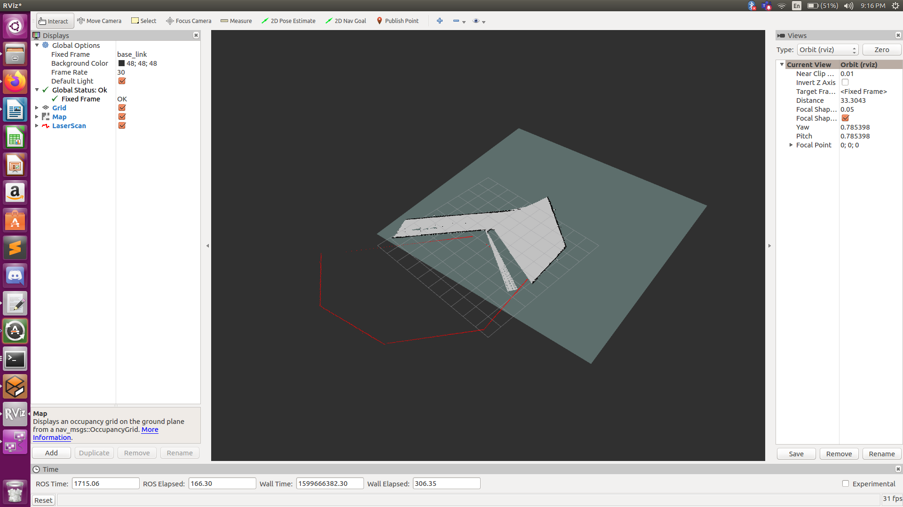
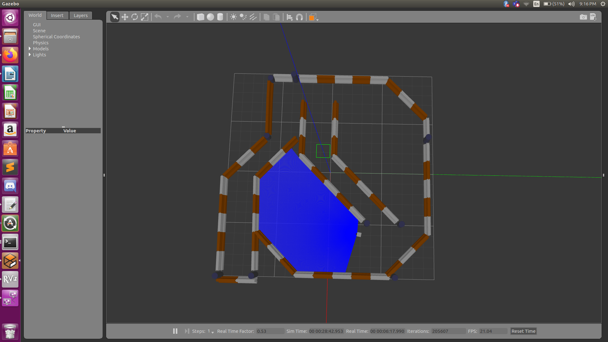
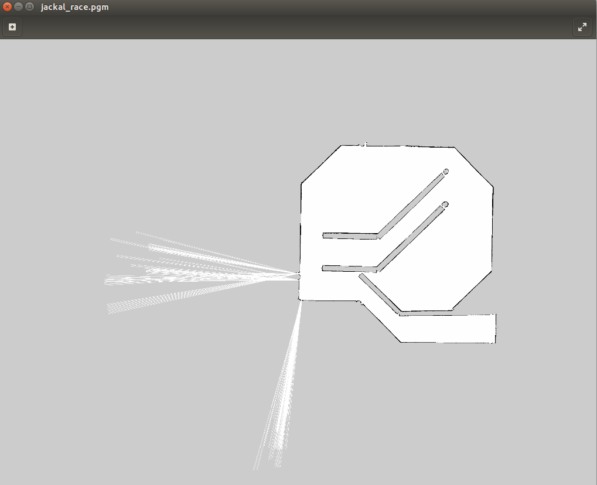
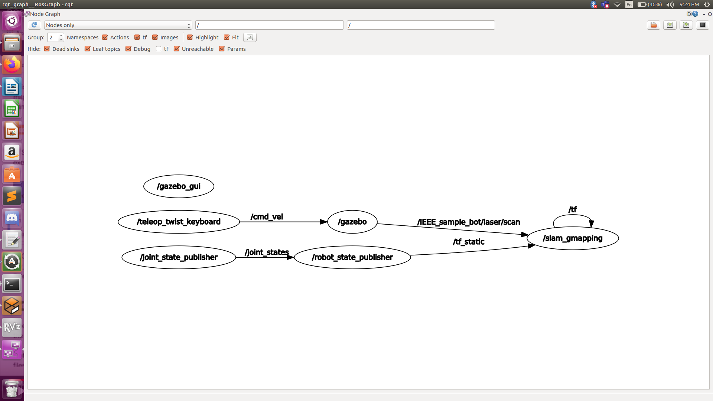

# Skid Steer Drive

The skid steering drive here is used on a four-wheel system. In general, skid steer’s mechanism is based on two facts: the tires on each side always rotate with the same speed and they can rotate forward and reverse. There is no explicit steering mechanism as such, it is achieved by actuating each side at a different rpm which makes it ‘SKID’. 

This mechanism can be employed as a plugin under the ‘gazebo_ros’ package (Code Available on github). Essentially this plugin is to enable you to use gazebo to give velocity commands and get odometry from gazebo.

```xml
<gazebo>
  <plugin name="skid_steer_drive_controller" filename="libgazebo_ros_skid_steer_drive.so">
    <updateRate>100.0</updateRate>
    <robotNamespace>/</robotNamespace>
    <leftFrontJoint>front_left_wheel_joint</leftFrontJoint>
    <rightFrontJoint>front_right_wheel_joint</rightFrontJoint>
    <leftRearJoint>back_left_wheel_joint</leftRearJoint>
    <rightRearJoint>back_right_wheel_joint</rightRearJoint>
    <wheelSeparation>0.4</wheelSeparation>
    <wheelDiameter>0.215</wheelDiameter>
    <robotBaseFrame>base_link</robotBaseFrame>
    <torque>20</torque>
    <topicName>cmd_vel</topicName>
    <broadcastTF>false</broadcastTF>
  </plugin>
</gazebo>
```

This is the gazebo plugin code snippet that is entered into your body file.

# Teleop Twist 

The teleop twist is a method of giving velocity commands. It is a package under ros-melodic, you can install it by using: 

```sudo apt-get install ros-melodic-teleop-twist-keyboard```

the driving controls are pretty straight forward. The back door process for this package is pretty simple, it has key bindings for movements and for every inputs it updates and publishes Twist messages. 

`twist.linear.i = self.i * self.speed` is the mechanism behind speed.
`twist.angular.z = self.th * self.turn` is the mechanism behind the turnings. 

You don't need to configure this module specifically and it doesn't take much time to master. 

`rosrun teleop_twist_keyboard teleop_twist_keyboard.py`

this is the command you need to run in the terminal, it is a node so a ros master has to be present and the topics required should exist. 

# Making Of the Bot

The bot which is just a cuboid with four wheels can be made by gazebo's model editor or pure XML code. You initially define a bunch of xacro:property which are your bot params like base length, width etc. You create macros for all the parts and make an instance of the bot. This Bot also has a Hokuyo Laser Scanner and a Camera. Both of these are to be mentioned in the body xacro file and a seperate xacro file for their plugins were made:

This is the camera plugin:
```xml
      <plugin name="camera_controller" filename="libgazebo_ros_camera.so">
        <alwaysOn>true</alwaysOn>
        <updateRate>0.0</updateRate>
        <cameraName>/camera</cameraName>
        <imageTopicName>image_raw</imageTopicName>
        <robotNamespace>IEEE_sample_bot</robotNamespace>
        <cameraInfoTopicName>camera_info</cameraInfoTopicName>
        <frameName>camera</frameName>
        <hackBaseline>0.07</hackBaseline>
        <distortionK1>0.0</distortionK1>
        <distortionK2>0.0</distortionK2>
        <distortionK3>0.0</distortionK3>
        <distortionT1>0.0</distortionT1>
        <distortionT2>0.0</distortionT2>
      </plugin>

```

This is the Laser scanner plugin:

```xml
      <plugin name="gazebo_ros_head_hokuyo_controller" filename="libgazebo_ros_laser.so">
        <topicName>/IEEE_sample_bot/laser/scan</topicName>
        <frameName>base_link</frameName>
      </plugin>
```

Both the file were made under the robot tag. Click [here](http://wiki.ros.org/xacro) to read more.

# ROS SLAM GMAPPING

This package contains GMapping, from OpenSlam, and a ROS wrapper. The gmapping package provides laser-based SLAM (Simultaneous Localization and Mapping), as a ROS node called slam_gmapping. Using slam_gmapping, you can create a 2-D occupancy grid map (like a building floorplan) from laser  and TF transforms from odom->base link(pose_data).

In layman’s term Gmapping is basically making a 2D map of the external 3D world using the robot’s laser and pose data. The map is then saved as a .pgm file and certain parameters are defined in the .yaml file.


```xml
<launch>
  <arg name="scan_topic"  default="/IEEE_sample_bot/laser/scan" />
  <arg name="base_frame"  default="base_link"/>
  <arg name="odom_frame"  default="odom"/>

  <node pkg="robot_state_publisher" type="robot_state_publisher" name="robot_state_publisher"></node>

  <node pkg="rviz" type="rviz" name="rviz"></node>

  <node pkg="gmapping" type="slam_gmapping" name="slam_gmapping" output="screen">
    <param name="base_frame" value="$(arg base_frame)"/>
    <param name="odom_frame" value="$(arg odom_frame)"/>
    <param name="map_update_interval" value="15.0"/>
    <param name="maxUrange" value="6.0"/>
    <param name="maxRange" value="8.0"/>
    <param name="sigma" value="0.05"/>
    <param name="kernelSize" value="1"/>
    <param name="lstep" value="0.05"/>
    <param name="astep" value="0.05"/>
    <param name="iterations" value="5"/>
    <param name="lsigma" value="0.075"/>  
    <param name="ogain" value="3.0"/>
    <param name="lskip" value="0"/>
    <param name="minimumScore" value="200"/>
    <param name="srr" value="0.01"/>
    <param name="srt" value="0.02"/>
    <param name="str" value="0.01"/>
    <param name="stt" value="0.02"/>
    <param name="linearUpdate" value="0.5"/>
    <param name="angularUpdate" value="0.436"/>
    <param name="temporalUpdate" value="-1.0"/>
    <param name="resampleThreshold" value="0.5"/>
    <param name="particles" value="80"/>
  <!--
    <param name="xmin" value="-50.0"/>
    <param name="ymin" value="-50.0"/>
    <param name="xmax" value="50.0"/>
    <param name="ymax" value="50.0"/>
  make the starting size small for the benefit of the Android client's memory...
  -->
    <param name="xmin" value="-1.0"/>
    <param name="ymin" value="-1.0"/>
    <param name="xmax" value="1.0"/>
    <param name="ymax" value="1.0"/>

    <param name="delta" value="0.05"/>
    <param name="llsamplerange" value="0.01"/>
    <param name="llsamplestep" value="0.01"/>
    <param name="lasamplerange" value="0.005"/>
    <param name="lasamplestep" value="0.005"/>
    <remap from="scan" to="$(arg scan_topic)"/>
  </node>
</launch>
```
The following code shows the g_mapping.launch file, which should be there in a ROS package named mapping_launch(You can name it whatever you want)

In the ROS workspace it is as follows :
IEEE_sample_bot > src > mapping_launch > launch > g_mapping.launch

In the above launch file, you can read about different parameters on ROS Wiki, the most important part is the first three lines of the launch file. As you can se we are defining the arguments as the topic names, the gmapping node will subscribe to these topics ans perform the transforms.

Run the following code in your terminal ROS workspace to start the `/slam_gmapping` node :

```
rosrun g_mapping g_mapping.launch
```
Once you run this code , the  `/slam_gmapping` node will be started and the rqt_graph will be as follows:



As you can see in the above image the `/slam_gmapping` node is subscribing to the topics `/IEEE_sample_bot/laser/scan` and the `/tf_static` topics. Where the `tf` basically transforms from odom->base link(pose_data) which helps the `/slam_gmapping` node to make a 2D Map.


Now run the following command to open Rviz:
```
rosrun rviz rviz 
```

We have used teleop_twist_keyboard  in order to move the robot within the gazebo world ,as the robot monouvres, you can se the map being updated in Rviz .
Once the map is traversed and you can see the complete map in rviz , you can save the map which is very important further in path planning where we will load the map into rviz .

To save the map , run the following command in the terminal :
```
rosrun map_server map_saver -f my_map
```
This command will save a my_map.pgm and a my_map.yaml file in the home directory.Where the .pgm file is basically an image file of the map generated using rviz and the .yaml file contains all the parameters of the image.


The my_map.yaml looks something like this
where `image: mymap.pgm` defines the .pgm file that is considered.

```
image: mymap.pgm
resolution: 0.050000
origin: [-12.200000, -1.000000, 0.000000]
negate: 0
occupied_thresh: 0.65
free_thresh: 0.196

```
Note: This is just for the example, we have used jackal_race world and thus the corresponding map.

The .pgm file looks something like this:


This is the image of RVIZ where we use teleop twist keyboard to move the bot and the real-time map is shown in RVIZ.


This is the Gazebo environment showing the world:


# ADAPTIVE MONTE-CARLO LOCALISATION (AMCL)

Localisation is the process of estimation of the position of the robot in a given environment. In this case, localisation specifically refers to estaimation of the position and orientation of a robot withtin the previously generated map. 
A relativey straightforward way of doing this is using 'Dead Reckoning' , which constitutes estimating the robot’s pose by calculating the distance travelled from an initial set-point with the help of odometry data. As expected, this is not a very accurate way of doing things. AMCL builds on this method, but adds an additional layer of accuracy by matching laser scan data with the map, thereby detecting any drift that may have occurred when estimating using dead reckoning. It then publishes transform data, which when taken into consideration, gives an accurate estimation of the robot's pose. 
Monte Carlo localization (MCL), also known as particle filter localization, is an algorithm for robots to localize using a particle filter. Given a map of the environment, the algorithm estimates the position and orientation of a robot as it moves and senses the environment. The algorithm uses a particle filter to represent the distribution of likely states, with each particle representing a possible state, i.e., a hypothesis of where the robot is. The algorithm typically starts with a uniform random distribution of particles over the configuration space, meaning the robot has no information about where it is and assumes it is equally likely to be at any point in space. Whenever the robot moves, it shifts the particles to predict its new state after the movement. Whenever the robot senses something, the particles are resampled based on recursive Bayesian estimation, i.e., how well the actual sensed data correlate with the predicted state. Ultimately, the particles should converge towards the actual position of the robot.
To install the amcl package, simply use the command sudo apt-get-install ros-melodic-amcl
The amcl package should now be install on your system.

In the simulation/launch folder, you will find an amcl.launch file. This file is responsible for launching the amcl node that executes localisation.


  <!-- Localization-->
    <node pkg="amcl" type="amcl" name="amcl" output="screen">

        <remap from="scan" to="/IEEE_sample_bot/laser/scan"/>

        <param name="odom_frame_id" value="odom"/>

        <param name="odom_model_type" value="diff-corrected"/>

        <param name="base_frame_id" value="base_link"/>

        <param name="global_frame_id" value="map"/>

        <param name="transform_tolerance" value="0.2"/>

        <param name="min_particles" value="5.0"/>

        <param name="max_particles" value="20.0"/>
    
    </node>

Here various parameters to fine tune the process are defined. Leaving these as they are, simply change the     <remap from="scan" to="/IEEE_sample_bot/laser/scan"/>
Line to suite whichever topic the laser scan data is being published on your system.


